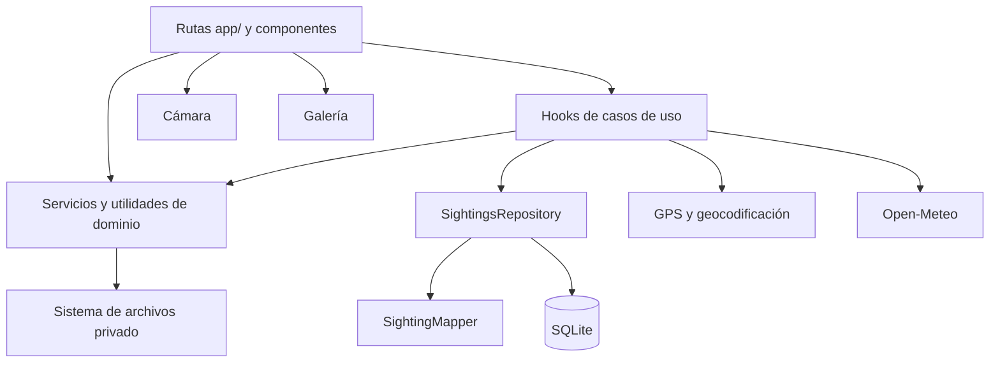
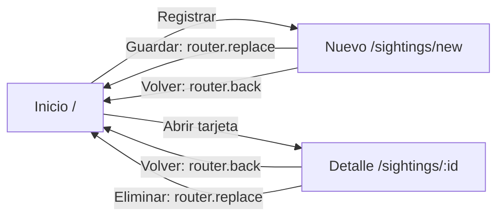

# AvistAves

Aplicación móvil local-first para registrar avistamientos de aves en Android. Cada registro combina fotografía, especie o nombre común, coordenadas GPS, fecha y hora, cantidad, notas opcionales y una instantánea meteorológica opcional. Los datos viven en SQLite dentro del dispositivo; las fotografías seleccionadas se copian al almacenamiento privado de la aplicación.

Proyecto académico construido con Expo SDK 57, React Native, TypeScript y Expo Router. No depende de un backend propio ni de variables de entorno para funcionar.

## Tabla de contenido

- [Estado y alcance](#estado-y-alcance)
- [Flujo principal](#flujo-principal)
- [Funcionalidades](#funcionalidades)
- [Stack tecnológico](#stack-tecnológico)
- [Arquitectura](#arquitectura)
- [Estructura del proyecto](#estructura-del-proyecto)
- [Navegación](#navegación)
- [Modelo de datos y persistencia](#modelo-de-datos-y-persistencia)
- [Cámara y galería](#cámara-y-galería)
- [Ubicación GPS](#ubicación-gps)
- [Clima](#clima)
- [Permisos](#permisos)
- [Validación y experiencia de usuario](#validación-y-experiencia-de-usuario)
- [Ordenamiento](#ordenamiento)
- [Eliminación de registros](#eliminación-de-registros)
- [Patrones de diseño](#patrones-de-diseño)
- [Decisiones de rendimiento y confiabilidad](#decisiones-de-rendimiento-y-confiabilidad)
- [Pruebas y calidad](#pruebas-y-calidad)
- [Requisitos del entorno](#requisitos-del-entorno)
- [Instalación y desarrollo](#instalación-y-desarrollo)
- [Builds Android](#builds-android)
- [Instalación de APK](#instalación-de-apk)
- [Distribución](#distribución)
- [Variables de entorno y secretos](#variables-de-entorno-y-secretos)
- [Solución de problemas](#solución-de-problemas)
- [Hallazgos de la auditoría](#hallazgos-de-la-auditoría)
- [Resumen académico](#resumen-académico)

## Estado y alcance

AvistAves cubre el ciclo principal de una bitácora de observación:

1. Registrar un avistamiento con foto, ubicación y datos de observación.
2. Consultar el historial persistido en el dispositivo.
3. Ordenar los registros por fecha, nombre o cantidad.
4. Abrir el detalle completo de un registro.
5. Eliminar el registro y su fotografía administrada por la aplicación.

Alcance actual:

- Plataforma objetivo de entrega: Android.
- Persistencia local: SQLite y sistema de archivos privado.
- Clima: Open-Meteo, sin API key.
- Desarrollo Android: development build con `expo-dev-client`.
- Distribución académica/interna: APK de perfiles `development` y `preview`.
- Fuera de alcance actual: autenticación, sincronización en nube, backend propio, búsqueda textual, filtros por criterios, edición de registros, exportación y publicación en Google Play.

El enfoque local-first permite consultar la lista y los detalles guardados sin conexión. La consulta meteorológica requiere red; la obtención de ubicación y la cámara dependen de capacidades y permisos del dispositivo.

## Flujo principal

1. La pantalla inicial carga los registros desde SQLite.
2. El usuario abre **Nuevo avistamiento**.
3. Toma una foto con la cámara o selecciona una desde la galería.
4. Obtiene coordenadas GPS. La aplicación intenta resolver una etiqueta legible y consulta el clima actual.
5. Completa nombre, fecha, hora, cantidad y notas.
6. La validación de dominio bloquea datos incompletos, inválidos o futuros.
7. La fotografía ya copiada al directorio privado se referencia mediante URI en SQLite.
8. Tras guardar, la aplicación reemplaza la ruta actual por la pantalla inicial.
9. Desde una tarjeta puede abrir el detalle o confirmar la eliminación.

## Funcionalidades

### Registro

- Captura fotográfica con `expo-camera`.
- Selección de imágenes con `expo-image-picker`.
- Copia de la imagen a almacenamiento privado mediante `expo-file-system`.
- Ubicación foreground con `expo-location`.
- Geocodificación inversa para mostrar una ubicación legible.
- Fecha y hora mediante selectores nativos.
- Cantidad entera positiva.
- Notas opcionales.
- Clima actual opcional: temperatura, humedad, código y descripción.

### Consulta

- Lista con estados de carga, error recuperable y lista vacía.
- Tarjetas con imagen y resumen del avistamiento.
- Detalle por identificador.
- Fallback visual cuando una imagen no puede mostrarse.
- Reintento de carga ante errores.

### Gestión

- Ordenamiento por fecha, nombre y cantidad.
- Confirmación explícita antes de eliminar.
- Eliminación coordinada entre SQLite y el archivo de imagen administrado.
- Conservación del criterio de ordenamiento después de recargar la lista.

## Stack tecnológico

| Área | Tecnología | Uso |
|---|---|---|
| Runtime móvil | React Native `0.86.3` | Interfaz y APIs nativas |
| Framework | Expo SDK `57` | Toolchain, configuración y módulos nativos |
| UI | React `19.2.3` | Componentes y estado |
| Lenguaje | TypeScript `6` con modo estricto | Tipado estático |
| Navegación | Expo Router `57` | Rutas basadas en archivos |
| Base de datos | `expo-sqlite` | Persistencia relacional local |
| Archivos | `expo-file-system` | Fotografías privadas |
| Cámara | `expo-camera` | Captura de fotografías |
| Galería | `expo-image-picker` | Selección de imágenes |
| Ubicación | `expo-location` | Permiso, GPS y geocodificación inversa |
| Fecha y hora | `@react-native-community/datetimepicker` | Selectores nativos |
| Estilos | NativeWind `4` y Tailwind CSS `3` | Sistema visual |
| Iconos | `@expo/vector-icons` | Iconografía nativa |
| Pruebas | Jest `29` y `jest-expo` | Pruebas unitarias |
| Calidad | ESLint `9` y TypeScript | Lint y verificación de tipos |
| Build | EAS CLI `24.3.0` | Builds Android locales con credenciales EAS |

Las versiones exactas y sus rangos son autoridad de `package.json` y `yarn.lock`.

## Arquitectura

La aplicación usa una arquitectura local-first en capas. No implementa MVC o MVVM de forma estricta; separa presentación, orquestación, dominio y persistencia con módulos pequeños.



### Responsabilidades

| Capa | Responsabilidad |
|---|---|
| `app/` | Composición de pantallas, navegación y estados visuales |
| `src/components/` | Componentes reutilizables de presentación |
| `src/hooks/` | Estado y orquestación de lista, detalle, formulario, ubicación y clima |
| `src/services/` | Adaptadores para clima, ubicación, fotos y eliminación coordinada |
| `src/domain/` | Entidades y validación independiente de UI |
| `src/repositories/` | Contrato CRUD y consultas SQL parametrizadas |
| `src/db/` | Apertura, migración y acceso a SQLite |
| `src/utils/` | Transformaciones puras: fechas, rutas, ordenamiento y formato |

La UI no ejecuta SQL. El repositorio tampoco conoce componentes, navegación ni permisos.

## Estructura del proyecto

```text
.
├── app/                    # Rutas Expo Router
│   ├── _layout.tsx         # Stack raíz
│   ├── index.tsx           # Lista de avistamientos
│   └── sightings/
│       ├── new.tsx         # Formulario de registro
│       └── [id].tsx        # Detalle
├── src/
│   ├── components/         # UI reutilizable
│   ├── db/                 # SQLite y migraciones
│   ├── domain/             # Entidad y validación
│   ├── hooks/              # Casos de uso y estado
│   ├── repositories/       # Persistencia de avistamientos
│   ├── services/           # Cámara indirecta, fotos, GPS, clima y borrado
│   └── utils/              # Funciones puras
├── assets/                 # Iconos, splash y recursos de Expo
├── scripts/                # Wrapper de builds locales EAS
├── docs/                   # Evidencia y documentación por iteración
├── build-outputs/          # APK generados; ignorados por Git
├── app.json                # Configuración Expo y plugins nativos
├── eas.json                # Perfiles development y preview
├── jest.config.js          # Configuración de pruebas
├── eslint.config.js        # Configuración de lint
└── package.json            # Scripts y dependencias
```

Los tipos están junto al módulo que los usa; no existe una capa global de tipos sin responsabilidad.

## Navegación

Expo Router deriva las rutas del sistema de archivos:

| Archivo | Ruta | Propósito |
|---|---|---|
| `app/index.tsx` | `/` | Lista principal |
| `app/sightings/new.tsx` | `/sightings/new` | Nuevo registro |
| `app/sightings/[id].tsx` | `/sightings/:id` | Detalle por ID |



`router.replace('/')` después de guardar o eliminar evita regresar mediante el historial a una pantalla cuyo estado ya no es válido.

## Modelo de datos y persistencia

### Entidad `Sighting`

| Campo | Tipo | Regla |
|---|---|---|
| `id` | `string` | UUID local |
| `birdName` | `string` | Obligatorio, sanitizado, máximo 50 caracteres |
| `photoUri` | `string` | URI obligatoria de archivo |
| `lat` | `number` | Entre -90 y 90 |
| `lon` | `number` | Entre -180 y 180 |
| `locationLabel` | `string \| null` | Etiqueta opcional |
| `observedAt` | `string` | Fecha ISO válida, no futura |
| `quantity` | `number` | Entero mayor o igual a 1 |
| `notes` | `string \| null` | Texto opcional |
| `temperature` | `number \| null` | Instantánea meteorológica opcional |
| `humidity` | `number \| null` | Instantánea meteorológica opcional |
| `weatherCode` | `number \| null` | Código WMO opcional |
| `weatherDescription` | `string \| null` | Descripción en español opcional |
| `createdAt` | `string` | Fecha de creación |
| `updatedAt` | `string` | Fecha de última actualización |

La velocidad del viento puede mostrarse durante el registro, pero no forma parte del modelo persistido.

### SQLite

- Archivo: `avistaves.db`.
- Versión de esquema: `PRAGMA user_version = 1`.
- Tabla principal con restricciones para nombre, coordenadas y cantidad.
- Índices por fecha de observación descendente y nombre sin distinguir mayúsculas.
- Consultas parametrizadas.
- Migraciones ejecutadas dentro de transacciones y en orden de versión.
- Filas SQLite en `snake_case` convertidas a dominio mediante un mapper que valida datos desconocidos.

### Fotografías

SQLite guarda la URI, no el binario. La imagen se copia a:

```text
<documentDirectory>/sightings/photos/photo-<id>.<extensión>
```

La extensión se limita a `jpg`, `jpeg`, `png` o `webp`. La eliminación de archivos verifica que la URI pertenezca directamente a ese directorio y que el nombre cumpla el formato esperado. La aplicación nunca elimina el archivo original de la galería.

La copia privada activa del formulario se elimina al reemplazarla, quitarla o desmontar la ruta sin guardar. Una vez confirmado el registro en SQLite, la fotografía queda comprometida y el desmontaje posterior no la elimina.

## Cámara y galería

### Cámara

- Solicita permiso al usar la función, no al iniciar la aplicación.
- Usa cámara trasera y captura de imagen fija.
- No solicita ni usa audio; Android bloquea `RECORD_AUDIO` en `app.json`.
- Presenta estados de preparación, captura, previsualización y error recuperable.
- Permite repetir la foto antes de aceptarla.
- Copia la foto aceptada al directorio privado.
- Detecta el retorno desde ajustes para actualizar el permiso.

### Galería

- Limita la selección a imágenes.
- Desactiva selección múltiple y edición.
- En iOS consulta y solicita permiso de biblioteca.
- En Android usa el selector del sistema provisto por `expo-image-picker`; no añade un permiso amplio de almacenamiento.
- Cancelar conserva el estado anterior.
- Copia la selección al almacenamiento privado; el original permanece intacto.

Cámara y galería son rutas independientes: denegar cámara no impide usar la galería.

## Ubicación GPS

La ubicación se solicita únicamente al tocar la acción correspondiente:

1. Consultar permiso foreground.
2. Solicitarlo si todavía puede preguntarse.
3. Mostrar una acción para abrir ajustes si el sistema ya no permite preguntar.
4. Obtener posición con precisión `Balanced`.
5. Validar latitud y longitud.
6. Intentar geocodificación inversa.
7. Consultar clima con las coordenadas válidas.

La lectura GPS tiene un límite de 15 segundos. La precisión real depende del dispositivo, entorno y proveedores del sistema; la aplicación no promete un margen numérico.

Si la geocodificación inversa falla, conserva las coordenadas y usa `Ubicación obtenida` como etiqueta. El usuario puede limpiar y volver a obtener la ubicación.

## Clima

AvistAves consulta:

```text
GET https://api.open-meteo.com/v1/forecast
```

Parámetros principales:

```text
latitude=<lat>
longitude=<lon>
current=temperature_2m,relative_humidity_2m,weather_code,wind_speed_10m
timezone=auto
```

Comportamiento:

- Valida la forma y los valores numéricos de la respuesta.
- Traduce códigos meteorológicos WMO a descripciones en español.
- Usa un timeout de 5 segundos.
- Realiza como máximo un reintento adicional.
- Reintenta errores de red, timeout, HTTP `429` y `5xx`.
- No reintenta errores `4xx` normales ni respuestas exitosas malformadas.
- Guarda en caché solo respuestas exitosas durante 10 minutos.
- Redondea coordenadas a tres decimales para la clave de caché.
- Deduplica solicitudes simultáneas para la misma ubicación.
- Ignora respuestas obsoletas cuando cambia la ubicación.

El clima es opcional. Un fallo de red no impide guardar: los campos meteorológicos permanecen en `null`. La lista y el detalle muestran la instantánea almacenada en el momento del registro; no vuelven a consultar Open-Meteo.

## Permisos

| Capacidad | Momento de solicitud | Denegación recuperable | Bloqueo persistente |
|---|---|---|---|
| Cámara | Al tocar **Tomar foto** | Explicación y nuevo intento | Acción **Abrir ajustes** |
| Galería en iOS | Al tocar **Galería** | Explicación y nuevo intento | Acción **Abrir ajustes** |
| Galería en Android | Al abrir selector del sistema | Gestionado por selector del sistema | No se solicita permiso amplio |
| Ubicación foreground | Al tocar **Obtener ubicación** | Explicación y nuevo intento | Acción **Abrir ajustes** |

La aplicación reevalúa permisos al volver desde ajustes. No solicita ubicación en segundo plano, micrófono ni acceso amplio al almacenamiento.

## Validación y experiencia de usuario

### Reglas de dominio

- Nombre de ave obligatorio.
- Máximo real: 50 caracteres.
- Caracteres permitidos: letras Unicode, marcas, números, espacios, `#` y `&`.
- Foto obligatoria.
- Coordenadas obligatorias y dentro de rango.
- Fecha y hora con formato válido y no futuras.
- Cantidad compuesta por dígitos y mayor o igual a 1.
- Notas opcionales.
- Clima opcional.

El repositorio vuelve a validar campos esenciales. Así, una llamada fuera del formulario no puede insertar coordenadas o cantidades inválidas.

### Estados y recuperación

- Errores por campo al perder foco y validación completa al guardar.
- Scroll automático al punto medio de los campos visuales faltantes.
- Pulso visual temporal en fotografía o ubicación faltante.
- Prevención de doble envío.
- Modal de confirmación al guardar.
- Carga, error, reintento, vacío y no encontrado en lista o detalle.
- Estados de clima: inactivo, cargando, disponible y no disponible.
- Acciones de reintento y apertura de ajustes donde corresponde.

La interfaz no implementa todavía una política específica para **reducir movimiento**; las animaciones actuales son breves.

## Ordenamiento

La lista carga inicialmente por fecha de observación, más reciente primero. La UI ordena una copia del arreglo y nunca muta el resultado original.

| Control | Primer toque | Toques posteriores |
|---|---|---|
| Fecha | Más reciente primero | Mantiene descendente |
| Nombre | A-Z | Alterna A-Z / Z-A |
| Cantidad | Mayor a menor | Alterna descendente / ascendente |

La comparación de nombres usa locale español con sensibilidad base. La versión actual ofrece ordenamiento; no ofrece búsqueda textual ni filtrado.

## Eliminación de registros

La eliminación usa el mismo servicio desde tarjeta y detalle:

1. Mostrar confirmación destructiva.
2. Buscar el registro por ID.
3. Eliminar la fila SQLite.
4. Intentar eliminar la fotografía privada.
5. Recargar la lista o reemplazar la ruta de detalle por inicio.

La base de datos se elimina primero. Si falla esa operación, el modal permanece abierto, se muestra un error y no existe navegación de falso éxito. Si falla la limpieza posterior del archivo, la fila permanece eliminada: el error de archivos no restaura un registro ya borrado.

Solo se elimina una fotografía reconocida como propiedad de AvistAves. Una URI externa o con formato inesperado se ignora.

## Patrones de diseño

### Repository Pattern

`SightingsRepository` concentra creación, lectura, listado y eliminación. Expone objetos de dominio y oculta SQL, nombres de columnas y detalles de `expo-sqlite`. La inyección del proveedor de base permite probarlo sin abrir la base nativa.

### Service Layer y adaptadores

Los servicios encapsulan límites externos:

- `weatherService`: HTTP, validación, retry, timeout y caché.
- `locationService`: coordenadas y etiquetas de geocodificación.
- `photoService`: copia, propiedad y eliminación segura de archivos.
- `sightingService`: orden de eliminación entre repositorio y archivo.

Esto evita que pantallas repitan reglas de infraestructura.

### Data Mapper

El mapper recibe filas SQLite desconocidas, valida tipos y nulabilidad, transforma `snake_case` a `camelCase` y produce `Sighting`. También limita las cláusulas de ordenamiento a una lista fija.

### Custom Hooks y composición

Los hooks agrupan estado y casos de uso sin introducir un store global:

- Lista y recarga.
- Carga de detalle.
- Estado del formulario.
- Captura de ubicación.
- Consulta meteorológica.

Componentes como encabezado, pantalla, campo y modal se componen en cada ruta. No existe Context global, Redux ni una fábrica especulativa.

## Decisiones de rendimiento y confiabilidad

| Decisión | Beneficio |
|---|---|
| SQLite con índices por fecha y nombre | Lectura local predecible |
| Fotografías como archivos, no blobs SQLite | Menor presión sobre la base |
| Consulta Open-Meteo con solo campos actuales necesarios | Menor respuesta de red |
| Timeout y reintento selectivo | Evita esperas indefinidas y tormentas de retry |
| Caché exitosa de 10 minutos | Reduce llamadas repetidas cercanas |
| Deduplicación en vuelo | Evita solicitudes duplicadas |
| Versionado de solicitudes en el hook | Evita mostrar respuestas obsoletas |
| Instantánea meteorológica persistida | Lista y detalle no dependen de red |
| Ordenamiento sobre copia | Conserva fuente inmutable |
| SQL parametrizado | Evita interpolación de datos |
| Build local fuera de `/tmp` | Reduce fallos por espacio temporal |

La solución favorece primitivas del SDK y dependencias ya instaladas; no añade un cliente HTTP, gestor de estado o capa de caché externa.

## Pruebas y calidad

### Comandos

```bash
yarn typecheck
yarn lint
yarn test --runInBand
```

`jest.config.js` usa `jest-expo`. Las rutas de `app/` están excluidas; la suite actual es principalmente unitaria.

Resultado de esta auditoría: **18 suites y 142 pruebas aprobadas**.

Áreas cubiertas:

- Validación de nombre, fecha, hora, cantidad, foto y GPS.
- Rechazo de fechas futuras.
- Conversión del formulario a entrada persistible.
- Repositorio: creación, consulta, listado, eliminación y límites de dominio.
- Mapper SQLite y ordenamientos permitidos.
- Ordenamiento de lista.
- Propiedad y rutas seguras de fotografías.
- Ciclo de vida de fotografías de borrador: abandono, guardado, reemplazo, eliminación, URI externas y fallos de cleanup.
- Orden de eliminación y errores de persistencia.
- Recuperación de permisos y política por plataforma.
- Coordenadas, etiquetas de geocodificación y códigos meteorológicos.
- Clima: parsing, URL mínima, timeout, retry, caché, errores y respuestas inválidas.
- Cálculo del scroll a campos obligatorios.
- Identificadores de ruta y control de respuestas meteorológicas obsoletas.

Límites de la automatización:

- No renderiza pantallas completas ni sustituye pruebas en dispositivo.
- No valida calidad real de cámara, GPS o red.
- No valida diálogos nativos de permisos.
- No instala APK.

La evidencia manual se conserva en:

- [`docs/P16/validation.md`](docs/P16/validation.md)
- [`docs/P14/android-smoke-checklist.md`](docs/P14/android-smoke-checklist.md)
- [`docs/P14/manual-build.md`](docs/P14/manual-build.md)

## Requisitos del entorno

Base documentada y validada para el proyecto:

- Linux para el wrapper de build local.
- Node.js 22.
- Yarn Classic 1.22.
- JDK 17.
- Android SDK y NDK compatibles con Expo SDK 57.
- `adb` para instalar APK y depurar dispositivo.
- Cuenta Expo con acceso al proyecto y sus credenciales Android.

El repositorio no fija `engines`; use las versiones compatibles indicadas por Expo SDK 57. Java 17 es la base de build registrada en la documentación del proyecto.

Para desarrollo en dispositivo:

- Depuración USB habilitada.
- Dispositivo autorizado en `adb devices`.
- PC y dispositivo con conectividad entre sí cuando el development build usa Metro.

## Instalación y desarrollo

### 1. Clonar e instalar

```bash
git clone <URL_DEL_REPOSITORIO>
cd avist-aves-ipss
yarn install
```

### 2. Verificar calidad

```bash
yarn typecheck
yarn lint
yarn test --runInBand
```

### 3. Instalar un development build

Genere o use el APK de desarrollo:

```bash
yarn build:dev
adb install -r build-outputs/development/avistaves-development.apk
```

### 4. Iniciar Metro

```bash
yarn start
```

Abra AvistAves en el dispositivo y seleccione el servidor de desarrollo. El script `start` ejecuta `expo start --dev-client`.

También existen:

```bash
yarn android
yarn ios
yarn web
```

Estos comandos inician Expo para cada plataforma; `yarn android` no sustituye la generación del APK durable.

### Cuándo reconstruir el development build

Reconstruya después de:

- Cambiar dependencias con código nativo.
- Modificar plugins o propiedades nativas de `app.json`.
- Cambiar de Expo SDK.

Un cambio solo de TypeScript, estilos o recursos procesados por Metro normalmente no requiere reconstrucción nativa.

## Builds Android

`scripts/eas-local-build.sh` es la entrada reproducible para los dos perfiles:

```bash
yarn build:dev
yarn build:preview
```

Equivalencias:

| Script | Perfil EAS | Resultado |
|---|---|---|
| `yarn build:dev` | `development` | `build-outputs/development/avistaves-development.apk` |
| `yarn build:preview` | `preview` | `build-outputs/preview/avistaves-preview.apk` |

El wrapper:

1. Valida que el perfil sea `development` o `preview`.
2. Crea un directorio único bajo `~/.cache/eas-local-builds/`.
3. Separa `work/` y `artifacts/`.
4. Configura `EAS_LOCAL_BUILD_WORKINGDIR` y `EAS_LOCAL_BUILD_ARTIFACTS_DIR`.
5. Ejecuta `npx -y eas-cli@24.3.0 build --platform android --local`.
6. Escribe el APK en una ruta determinista.
7. Limpia el directorio temporal al salir o recibir una señal.

La carpeta fuera de `/tmp` reduce el riesgo de agotar el espacio temporal durante Gradle. Aun así, el volumen `$HOME` debe tener espacio suficiente.

Antes de construir:

```bash
npx eas-cli@24.3.0 login
```

En automatización puede usarse `EXPO_TOKEN`. Aunque la compilación es local, EAS autentica el proyecto y obtiene las credenciales Android asociadas.

### Diferencia entre perfiles

- `development`: incluye `expo-dev-client`; necesita Metro para ejecutar el JavaScript de desarrollo.
- `preview`: APK interno con bundle JavaScript; funciona sin Metro.

## Instalación de APK

Verifique el dispositivo:

```bash
adb devices
```

Instale o reemplace una instalación compatible:

```bash
adb install -r build-outputs/development/avistaves-development.apk
```

Para preview:

```bash
adb install -r build-outputs/preview/avistaves-preview.apk
```

`-r` intenta conservar datos cuando package y firma son compatibles. Para probar una instalación completamente limpia puede desinstalar primero, pero eso elimina la base SQLite, las fotografías privadas y el estado de permisos.

## Distribución

Configuración actual:

- Identificador Android: `com.wuanpack.avistaves`.
- Nombre visible: `AvistAves`.
- Versión: `1.0.0`.
- Perfiles EAS: `development` y `preview`.
- Formato: APK.
- Distribución: interna.

No existe perfil `production`, generación AAB ni flujo de envío a Google Play. Agregarlos solo cuando exista una necesidad real de publicación, firma de producción, versionado de `versionCode` y política de distribución.

## Variables de entorno y secretos

### Runtime

No se requiere archivo `.env`. Open-Meteo no usa API key y la aplicación no contiene un backend propio.

### Build

- La autenticación EAS puede residir en la sesión de `eas login`.
- `EXPO_TOKEN` es opcional para ejecución no interactiva.
- El keystore Android se administra fuera del repositorio mediante EAS.
- No deben confirmarse keystores, certificados, tokens ni archivos de credenciales.

`.gitignore` excluye archivos locales de entorno, credenciales comunes, APK, AAB, directorios de plataforma generados y salidas de build.

## Solución de problemas

### `adb devices` no muestra el teléfono

- Active opciones de desarrollador y depuración USB.
- Acepte la huella RSA en el dispositivo.
- Cambie cable o modo USB.
- Si aparece `unauthorized`, revoque y vuelva a autorizar la depuración.

### Development build no conecta con Metro

- Ejecute `yarn start`.
- Confirme conectividad entre PC y dispositivo.
- Reinicie Metro si la URL quedó obsoleta.
- Verifique que instaló el perfil `development`, no `preview`.

### Cambios nativos no aparecen

Metro no recompila módulos nativos. Ejecute de nuevo:

```bash
yarn build:dev
adb install -r build-outputs/development/avistaves-development.apk
```

### Cámara o GPS permanecen bloqueados

Use **Abrir ajustes** y habilite el permiso. Para simular primer uso puede reinstalar, pero una desinstalación borra todos los datos locales.

### Fallo de clima

El registro sigue siendo válido sin clima. Revise conectividad, disponibilidad de Open-Meteo y hora del dispositivo. Use el reintento de ubicación para emitir una nueva consulta.

### Build local sin espacio

- Revise espacio libre en `$HOME`.
- El wrapper ya evita `/tmp` y elimina su scratch al terminar.
- Confirme si el APK llegó a `build-outputs/<perfil>/`.
- Limpie cachés externas solo después de identificar cuál ocupa espacio.

### EAS solicita autenticación o credenciales

```bash
npx eas-cli@24.3.0 whoami
npx eas-cli@24.3.0 login
```

La cuenta debe tener acceso al proyecto EAS configurado en `app.json`.

### Dependencias incompatibles con Expo

Ejecute el diagnóstico:

```bash
npx expo-doctor
```

Revise el reporte antes de actualizar. No cambie paquetes automáticamente durante una entrega validada.

## Hallazgos de la auditoría

La revisión técnica del código, configuración, scripts y documentación detectó:

1. **Documentos históricos desactualizados.** Algunos archivos de `docs/` describen etapas anteriores sin galería ni eliminación. Este README refleja el comportamiento actual; esos archivos se conservan como evidencia cronológica.
2. **Build documentado anteriormente.** Un documento histórico menciona otra ruta scratch; el script actual usa `~/.cache/eas-local-builds/<perfil>-<id>/{work,artifacts}`.
3. **Cobertura.** La lógica de dominio e infraestructura tiene pruebas unitarias; las pantallas, permisos nativos, cámara, GPS e instalación APK requieren verificación manual.
4. **Distribución.** La configuración solo cubre APK internos; no representa una preparación para tienda.

Estos puntos no se ocultan como capacidades completas. Sirven como límites explícitos para defensa, mantenimiento y trabajo futuro.

## Resumen académico

AvistAves demuestra integración coherente de capacidades móviles nativas con una arquitectura mantenible:

- Navegación declarativa mediante rutas de archivos.
- Captura y selección de imágenes con persistencia privada.
- Permisos solicitados en contexto y recuperación desde ajustes.
- Ubicación foreground y geocodificación inversa.
- Consumo robusto de una API pública con timeout, retry, caché y validación.
- Persistencia relacional local con migración, índices, restricciones y mapper.
- Validación compartida entre formulario y repositorio.
- Eliminación segura y coordinada de datos y archivos.
- Estados de UI recuperables.
- Automatización de typecheck, lint, pruebas y builds Android locales.

La decisión central es mantener el producto local-first y sin backend mientras el alcance solo requiere una bitácora personal. Añadir autenticación, sincronización o infraestructura remota antes de necesitarlas aumentaría complejidad, superficie de fallos y costo operativo sin mejorar el requisito actual.

Referencias técnicas:

- [Expo SDK 57](https://docs.expo.dev/versions/v57.0.0/)
- [Development builds](https://docs.expo.dev/develop/development-builds/introduction/)
- [EAS local builds](https://docs.expo.dev/build-reference/local-builds/)
- [APK para Android](https://docs.expo.dev/build-reference/apk/)
- [Credenciales Android](https://docs.expo.dev/app-signing/app-credentials/)
- [Open-Meteo Forecast API](https://open-meteo.com/en/docs)
