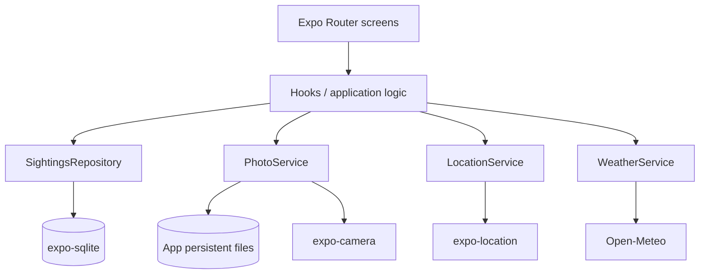

# Architecture Decision

## Decision

Use a small local-first layered architecture:



Screens render state and dispatch actions. Hooks/application logic coordinate the registration transaction. Services isolate device/API behavior. Repository owns SQLite SQL and row mapping. Dependencies point downward; no backend.

## Planned modules

```text
app/
  _layout.tsx
  index.tsx
  sightings/new.tsx
  sightings/[id].tsx
src/
  components/       # reusable UI pieces
  hooks/             # screen/application orchestration
  services/         # WeatherService, LocationService, PhotoService
  repositories/     # SightingsRepository
  db/               # SQLite provider, schema/migrations
  domain/           # Sightings types, validation, weather mapping
  utils/             # small pure transformations
```

Routes match conceptual views and keep dynamic detail IDs explicit. Exact filenames remain an implementation decision in P1.

## Flows

Registration: request camera permission → capture photo → copy temporary URI to durable app file → request location permission → obtain GPS → reverse geocode best effort → request Open-Meteo with timeout/retry/cache → validate required fields → insert SQLite row → return to list. Weather and label failures produce nullable/diagnostic state, not registration failure. If required photo/location fails, save is disabled and retry remains available.

List: repository `findAll` → newest-first query → map rows to cards; sort by date/name/quantity in SQL or pure deterministic mapper. Detail: `findById` → large persistent photo, fields, weather, label, coordinates.

## Async and errors

Each operation exposes `idle | loading | success | error`; screens render spinner/disabled action, result, or recoverable message. Errors are typed at service boundaries and logged without secrets. SQLite initialization has an explicit error surface. No unhandled permission rejection reaches UI.

## Permissions

Camera and foreground location permissions are requested only at point of need, preceded by rationale. Denied state explains consequence and offers retry/settings route where platform supports it. Save requires successful camera capture and location; weather/reverse geocode are optional.

## Integration decisions

- Camera: `expo-camera`; no gallery picker.
- Location: `expo-location`; original lat/lon always retained; `reverseGeocodeAsync` creates `locationLabel` best effort.
- Weather: Open-Meteo current variables temperature, relative humidity, and weather code. Unknown codes map to `Unknown conditions`, never crash.
- Files: use Expo file-system persistent app directory; copy/move camera URI before DB insert. Orphan cleanup on failed insert is required in P5.
- Persistence: `expo-sqlite`, schema version/migration path from first release; no AsyncStorage sightings.
- Build: EAS Preview Android APK; distribute through GitHub Release, never Git history.

## Performance and security

Weather request uses finite timeout, one retry only for recoverable failures, and coordinate-bucket TTL cache. Cache is in-memory initially; it is optimization, not source of truth. Validate untrusted API JSON before mapping. No secrets required for Open-Meteo.

## UI principles for P3

Outdoor-first: high contrast, legible type, minimum platform touch target, visible primary action, consistent spacing, one-hand flow, immediate feedback. Visual styling waits for frontend-design phase; P0 fixes principles only.

## Pattern candidates

Component Pattern, Repository Pattern, Service/Adapter Pattern. They become report evidence only if implementation contains genuine examples; do not force abstractions.
